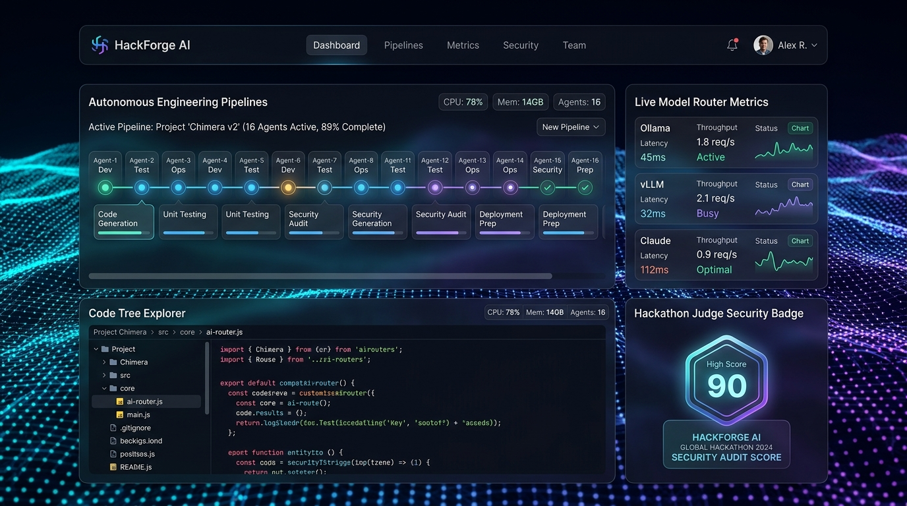
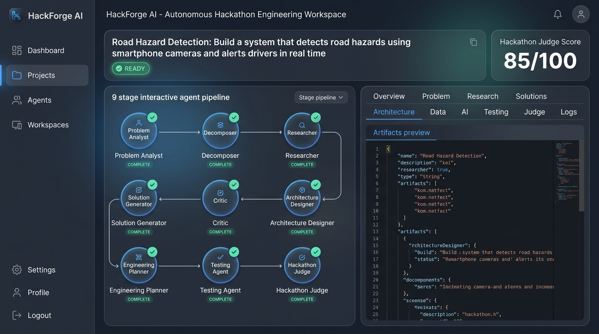
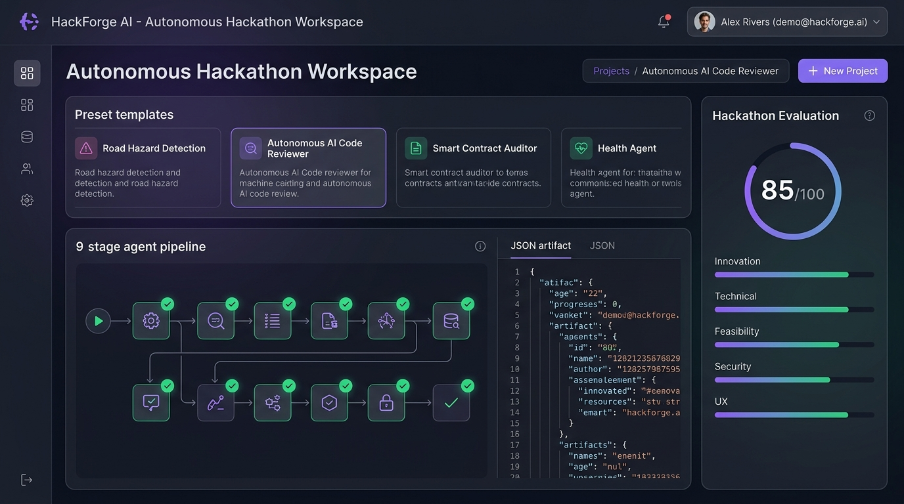
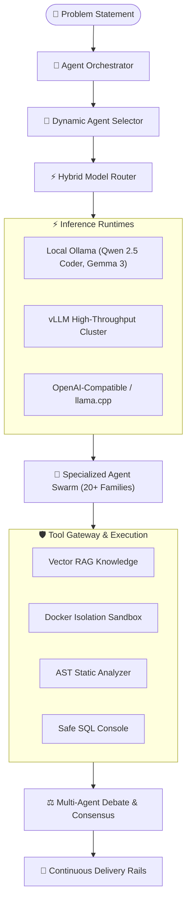

# HackForge AI — Autonomous Engineering Operating System

[](https://www.python.org/)
[](https://fastapi.tiangolo.com/)
[](https://nextjs.org/)
[](https://react.dev/)
[](backend/tests/)
[](Dockerfile.backend)
[](k8s/)
[](LICENSE)

> **HackForge AI** is an enterprise-grade **Autonomous Engineering Operating System** combining an AI Engineering Command Center, AI Laboratory, Autonomous Software Factory, and Security Operations Center (SOC). It takes high-level problem statements and coordinates specialized open-source agent swarms, hybrid inference runtimes, zero-trust security gates, and automated deployment pipelines into verified, production-ready software systems.

---

## 📸 Platform Demonstration & Visual Tour

<div align="center">
  <h3>⚡ Executive AI Engineering Command Center & System Orbit</h3>
  
  <p><em>Real-time System Orbit topology canvas, active operations telemetry, database health, and hybrid inference mesh indicators.</em></p>
</div>

<br />

<div align="center">
  <h3>🛠️ Autonomous Software Factory & Live Agent Swarm Execution</h3>
  
  <p><em>16-stage autonomous code synthesis workspace, streaming log terminals, multi-file code diffing, and live web preview sandbox.</em></p>
</div>

<br />

<div align="center">
  <h3>🛡️ Zero-Trust Security Operations Center (SOC) & Defense Radar</h3>
  
  <p><em>Real-time prompt injection firewall, AST security analyzer, secret vault masking, and human-in-the-loop deployment approvals.</em></p>
</div>

---

## 🌟 Core Product Pillars & Architecture

```text
                         HACKFORGE AI
                   AUTONOMOUS ENGINEERING OS
                              │
        ┌─────────────────────┼─────────────────────┐
        │                     │                     │
      BUILD                 KNOW                 OPERATE
        │                     │                     │
    AI Agents              Research             Executions
    Projects               Knowledge            Automations
    Workflows              Models               Deployments
    Code Generation        Datasets             Analytics
        │                     │                     │
        └─────────────────────┼─────────────────────┘
                              │
                           CONTROL
                              │
                 Security • Database • Team
                 Policies • Audit • Governance
                              │
                         INFRASTRUCTURE
                              │
                 Local • Cloud • Hybrid AI
```

HackForge AI organizes all platform capabilities into 4 Core User Goals:
1. **BUILD**: Transform problem statements into architecture, multi-file codebases, automated tests, and container configs.
2. **KNOW**: Ingest enterprise standards, explore open-source documentation, run semantic RAG vector searches, and execute deep autonomous research.
3. **OPERATE**: Real-time execution tracing, scheduled cron automations, continuous delivery rails, and telemetry analytics.
4. **CONTROL**: Zero-Trust Security Operations Center (SOC), SQLAlchemy schema explorer, cryptographic audit trails, and multi-tenant access control.

---

## 🤖 Open-Source Multi-Model Agent Mesh

HackForge AI decouples **Agents** from specific **Models**:
- **Agent**: Defines purpose, instructions, capabilities, permissions, tools, and evaluation policies.
- **Model**: Provides reasoning, generation, vision, coding, and tool execution (Qwen, Gemma, Llama, Mistral, DeepSeek, Phi).



### 20+ Specialized Agent Families
| Domain | Specialized Agents | Core Models |
|---|---|---|
| **Management** | `Engineering Planner Agent`, `System Orchestrator Agent` | Gemma 3:4b, Qwen 2.5 Coder |
| **Research** | `Deep Research Agent`, `GitHub Explorer Agent` | Gemma 3:4b, Qwen 2.5 Coder |
| **Product** | `Product Strategy & Requirements Agent` | Gemma 3:4b |
| **Architecture** | `Solution & Cloud Architect` | Gemma 3:4b, Llama 3.3:70b |
| **Development** | `Python Core Engineer`, `TypeScript Engineer`, `Full-Stack Engineer` | Qwen 2.5 Coder, DeepSeek Coder |
| **AI / ML** | `AI / ML Systems Engineer`, `RAG & Vector Engineer` | Qwen 2.5 Coder, Gemma 3:4b |
| **Data** | `Data Engineering Specialist`, `Database Architect` | Qwen 2.5 Coder, Gemma 3:4b |
| **Science & Math** | `Computational Science & Math Agent` | Gemma 3:4b, NumPy/SciPy |
| **Quant Finance** | `Quantitative Modeling Specialist` | Gemma 3:4b, Time-Series |
| **Cybersecurity** | `Zero-Trust Cybersecurity Auditor` | Qwen 2.5 Coder, AST Scanner |
| **DevOps / SRE** | `DevOps & Kubernetes Engineer`, `SRE Lead` | Qwen 2.5 Coder, K8s HPA |
| **Testing** | `QA & Test Automation Specialist` | Qwen 2.5 Coder, Pytest/Vitest |
| **Debugging** | `Self-Healing Debug Agent` | Qwen 2.5 Coder, AST Patching |
| **Code Review** | `Principal Code Reviewer` | Gemma 3:4b, Static Analysis |
| **Documentation** | `Technical Documentation Specialist` | Gemma 3:4b, Markdown/OpenAPI |
| **Deployment** | `Continuous Delivery & Release Manager` | Gemma 3:4b, Quality Gates |
| **Evaluation** | `Executive Hackathon Judge & Evaluator` | Gemma 3:4b, Rubric Scoring |
| **Communication** | `Executive Reporting & Briefing Agent` | Gemma 3:4b |

---

## 🎨 HACKFORGE APEX Design System

Designed with the **HACKFORGE APEX** visual identity:
- **Design Tokens**: Void background (`#05060A`), Obsidian surfaces (`#090B11`, `#0E1118`), Subtle borders (`#202531`).
- **Accents**: Electric Violet (`#8B5CF6`), Cyan Intelligence (`#06B6D4`), Emerald Success (`#10B981`), Amber Warning (`#F59E0B`), Red Threat (`#EF4444`).
- **Interactive Orbit Topology Canvas (`SystemOrbitCanvas.tsx`)**: Central glowing node representing `HACKFORGE CORE OS v1.5` with orbiting satellites (16 Domain Agents, Model Mesh, Knowledge Vectors, Docker/AST Tools, Workflows, Zero-Trust SOC, SQL Database Core, Continuous Delivery Rails).
- **Notification Drawer**: Slide-out activity panel for real-time security alerts and one-click authorization for pending deployment pipelines.

### Complete 24-Route Coverage
* **WORKSPACE**: [`/dashboard`](frontend/app/dashboard), [`/projects`](frontend/app/projects), [`/`](frontend/app/page.tsx)
* **BUILD**: [`/agents`](frontend/app/agents), [`/workflows`](frontend/app/workflows), [`/automations`](frontend/app/automations)
* **KNOWLEDGE**: [`/knowledge`](frontend/app/knowledge), [`/research`](frontend/app/research)
* **INFRASTRUCTURE**: [`/models`](frontend/app/models), [`/models/compare`](frontend/app/models/compare), [`/servers`](frontend/app/servers), [`/tools`](frontend/app/tools)
* **ENGINEERING**: [`/executions`](frontend/app/executions), [`/deployments`](frontend/app/deployments)
* **CONTROL**: [`/security`](frontend/app/security), [`/database`](frontend/app/database), [`/analytics`](frontend/app/analytics), [`/audit`](frontend/app/audit)
* **SYSTEM**: [`/settings`](frontend/app/settings), [`/settings/routing`](frontend/app/settings/routing)
* **SHOWCASE**: [`/landing`](frontend/app/landing)

---

## 🛡️ Zero-Trust Security & Database Control Center

- **AST Security Scanner**: Pre-execution static analysis catching dangerous `os.system`, `subprocess`, `eval`, or unauthenticated shell calls before container execution.
- **Prompt Injection Firewall**: Real-time inspection of inbound prompts catching adversarial evasion attempts, role-play bypasses, and jailbreak tokens.
- **Secret Vault & Masking**: Sensitive keys (`sk-...`, `Bearer`, tokens) are masked from logs, UI telemetry, and model prompts.
- **Database Command Center**: Real-time schema inspection, pool telemetry, and read-only parameterized query execution across SQLite and PostgreSQL.
- **Continuous Delivery Rails**: Multi-environment progression (Development, Staging, Production) requiring cryptographically signed executive approvals for staging and production rollouts.

---

## ⚡ Inference Runtimes & Routing Modes

HackForge AI guarantees privacy and cost predictability through configurable routing modes:
1. `OPEN_SOURCE_ONLY`: Strictly blocks any cloud API calls; only local Ollama, vLLM, or llama.cpp runtimes are permitted.
2. `LOCAL_FIRST`: Prefers free, zero-latency local models; falls back to cloud providers only if explicitly permitted.
3. `OFFLINE`: Complete airgap isolation; internet tools and remote model endpoints are disabled.
4. `HYBRID`: Balances capability, tokens/sec, latency, and cost per task.

---

## 🚀 Quick Start & Installation

### Prerequisites
* **Python 3.12+**
* **Node.js 18+** / **npm**
* **Ollama** (for local open-source models):
  ```bash
  ollama pull qwen2.5-coder:1.5b
  ollama pull gemma3:4b
  ```

### Option 1: Automated 1-Click Launcher (Recommended)
Run from the repository root:
```bash
python launch.py
```
* Seeds the database with default schemas, security policies, and knowledge bases.
* Starts FastAPI backend on `http://127.0.0.1:8000`.
* Starts Next.js frontend on `http://127.0.0.1:3000`.
* Opens the Command Center in your default browser.

### Option 2: Windows 1-Click Batch File
```cmd
start_hackforge.bat
```

### Option 3: Manual Startup
```bash
# Backend
cd backend
python -m venv .venv
# On Windows: .venv\Scripts\activate | On Linux/macOS: source .venv/bin/activate
pip install -r requirements.txt
python -m uvicorn app.main:app --host 127.0.0.1 --port 8000

# Frontend
cd ../frontend
npm install
npm run dev
```

### Option 4: Docker Compose
```bash
docker compose up -d --build
```

---

## 🧪 Automated Testing Suite

HackForge AI includes a comprehensive test suite covering universal model adapters, multi-agent mesh orchestration, zero-trust security policies, and database services:

```bash
cd backend
.venv\Scripts\python.exe -m pytest -v
```

```text
tests/test_agent_mesh.py ........                                        [ 20%]
tests/test_agents_16.py .                                                [ 22%]
tests/test_database_and_security.py ..........                           [ 47%]
tests/test_hybrid_providers.py .........                                 [ 70%]
tests/test_k8s_and_company_agents.py .                                   [ 72%]
tests/test_mesh.py ......                                                [ 87%]
tests/test_platform.py .....                                             [100%]

======================= 40 passed, 2 warnings in 30.47s =======================
```

---

## 📡 API Reference Overview

| Endpoint | Method | Description |
|---|---|---|
| `/health` | `GET` | System health probe (liveness) |
| `/ready` | `GET` | Readiness probe (database, redis, mesh status) |
| `/api/mesh/agents` | `GET` | List all 24 specialized agents and assigned models |
| `/api/mesh/matrix` | `GET` | Live Model-Agent capability matrix |
| `/api/mesh/teams` | `GET` | Pre-configured agent swarm templates |
| `/api/mesh/orchestrate/select` | `POST` | Dynamically select agent swarm for a problem statement |
| `/api/mesh/debate` | `POST` | Run 4-stage multi-agent debate and consensus protocol |
| `/api/mesh/runtimes` | `GET` | Inspect live inference runtimes (Ollama, vLLM, llama.cpp) |
| `/api/analytics` | `GET` | Platform telemetry, token locality ratio, and cost savings |
| `/api/executions` | `GET` | Real-time multi-agent execution traces with filters |
| `/api/deployments` | `GET` | Multi-environment deployment pipeline stages |
| `/api/deployments/{id}/approve` | `POST` | Sign & authorize human-in-the-loop deployment gate |
| `/api/knowledge` | `GET` | Vector knowledge bases and chunk metadata |
| `/api/tools` | `GET` | Registered tools & MCP server status |
| `/api/database/overview` | `GET` | Relational table schema metadata & pool stats |
| `/api/security/overview` | `GET` | Zero-Trust SOC posture & threat radar |

---

## 🐙 GitHub Repository

* **Repository**: [https://github.com/hackforge-ai/hackforge-ai](https://github.com/hackforge-ai/hackforge-ai)
* **Maintained by**: **HackForge AI Core Engineering Team**
* **License**: [MIT License](LICENSE)
