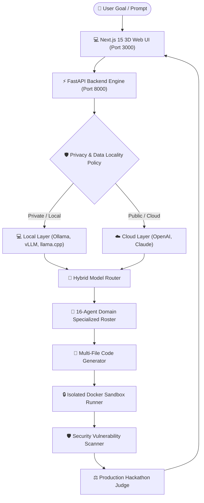

# HackForge AI — Autonomous Engineering Platform & Hybrid AI Mesh

[](https://www.python.org/)
[](https://fastapi.tiangolo.com/)
[](https://nextjs.org/)
[](https://react.dev/)
[](https://www.docker.com/)
[](https://kubernetes.io/)
[](LICENSE)

**HackForge AI** is an open-source-first autonomous AI engineering platform designed to take high-level problem statements and drive them through an enterprise-grade multi-agent pipeline into verified, tested, secure, and production-ready codebases.

---

## 🌟 Key Capabilities

* **🤖 16 Specialized Domain AI Agents**: Dedicated Pydantic contracts for every phase (Problem Analysis, Decomposition, Research, Data Engineering, AI/ML Modeling, Architecture, Backend, Frontend, Code Generation, Sandboxed Build, Self-Healing, Security Audit, Hackathon Judge).
* **🏢 Company-Level Multi-Level AI Leadership**: Executive VP of Engineering, CISO Security, Directors of Data & MLOps, Principal Backend & Frontend Leads, DevOps & SRE Leads, and Production Review Board.
* **⚡ Hybrid Local + Cloud AI Infrastructure**: Seamless execution across local daemons (**Ollama**, **vLLM**, **llama.cpp**, **Transformers**) and cloud APIs (**OpenAI**, **Anthropic Claude**).
* **🛡️ Data Locality & Privacy Policy Engine**: Strict `LOCAL_ONLY`, `CLOUD_ALLOWED`, `HYBRID`, and `PRIVACY_FIRST` policies. Sensitive secrets or confidential files are blocked from leaving the local host.
* **🔀 Smart Model Router & Circuit Breakers**: Automatic provider failover, local port scanning, and circuit breaker protection.
* **🎨 Animated 3D WebGL UI & UX**: Real-time 3D spatial particle mesh background, interactive 3D parallax tilt cards, orbital stage nodes, and dark slate glassmorphism design.
* **🐳 Production Docker & Kubernetes Ready**: Multi-stage Dockerfiles (`Dockerfile.backend`, `Dockerfile.frontend`), `docker-compose.yml`, and enterprise Kubernetes manifests (`k8s/` with HPA and NGINX Ingress).

---

## 🏗️ System Architecture



---

## 🚀 Quick Start

### Option 1: 1-Click Python Launcher (Recommended)
Run from the root repository:
```bash
python launch.py
```
This automatically seeds the database, launches FastAPI on `http://localhost:8000`, launches Next.js on `http://localhost:3000`, and opens the dashboard in your default browser.

### Option 2: 1-Click Windows Batch File
Double click or execute in command line:
```cmd
start_hackforge.bat
```

### Option 3: Docker Compose
Spin up the complete multi-service stack (Backend, Frontend, PostgreSQL, Redis, Ollama):
```bash
docker compose up -d --build
```

---

## 🐙 Push to Your GitHub

To link and push this complete production codebase to your GitHub repository:

```bash
# Set your GitHub remote repository (replace with your repo URL)
git remote add origin https://github.com/<your-username>/hackforge-ai.git

# Verify branch is set to main
git branch -M main

# Push all source code, manifests, and documentation
git push -u origin main
```

---

## ☸️ Kubernetes Deployment (`k8s/`)

Deploy to any Kubernetes cluster (EKS, GKE, AKS, or Minikube/k3s):

```bash
# 1. Create isolated namespace
kubectl apply -f k8s/namespace.yaml

# 2. Apply configmap and secrets
kubectl apply -f k8s/configmap-secrets.yaml

# 3. Deploy databases and cache
kubectl apply -f k8s/postgres-deployment.yaml
kubectl apply -f k8s/redis-deployment.yaml

# 4. Deploy backend and frontend with HPA
kubectl apply -f k8s/backend-deployment.yaml
kubectl apply -f k8s/frontend-deployment.yaml

# 5. Configure NGINX Ingress with TLS
kubectl apply -f k8s/ingress.yaml
```

---

## 🌐 Web Routes & API Endpoints

| Page / Endpoint | Purpose | URL |
| :--- | :--- | :--- |
| **Autonomous Workspace** | 3D Interactive Project Dashboard | `http://localhost:3000/` |
| **Specialized Agent Team** | 16-Agent Domain Roster | `http://localhost:3000/agents` |
| **AI Server Control Center** | Local & Cloud Server Health & Discovery | `http://localhost:3000/servers` |
| **Routing & Privacy Settings** | Data Locality & Policy Controls | `http://localhost:3000/settings/routing` |
| **Model Mesh Control Center** | Model Registry, Benchmark & Debate | `http://localhost:3000/models` |
| **Model Performance Matrix** | Multi-Model Benchmark Comparison | `http://localhost:3000/models/compare` |
| **FastAPI Interactive Docs** | OpenAPI Swagger Documentation | `http://localhost:8000/docs` |
| **Kubernetes Liveness Probe** | K8s Health Liveness Check | `http://localhost:8000/api/health/liveness` |
| **Kubernetes Readiness Probe**| K8s Health Readiness Check | `http://localhost:8000/api/health/readiness` |

---

## 🧪 Automated Testing

Run the full automated test suite (22 unit & integration tests):
```bash
cd backend
python -m pytest tests/test_platform.py tests/test_mesh.py tests/test_agents_16.py tests/test_hybrid_providers.py tests/test_k8s_and_company_agents.py
```

Result:
```text
============================= 22 passed in 7.57s ==============================
```

Build Next.js production bundle:
```bash
cd frontend
npm run build
```

---

## 📄 License
This project is licensed under the MIT License — see the [LICENSE](LICENSE) file for details.
